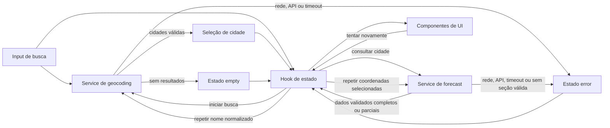

# Plano Técnico — Weather App

## Architecture

Aplicação cliente React, sem servidor próprio. Um hook local coordena busca, seleção e estado; serviços isolam as chamadas HTTP à Open-Meteo; funções puras validam e normalizam as respostas antes de torná-las dados de domínio. A UI recebe somente dados validados e apresenta os estados de cada operação.



Não há autenticação, backend, armazenamento local, cache, telemetria ou geolocalização automática (NFR7; Out of Scope). A interface oferece temas claro e escuro com claro como padrão, mantém superfícies translúcidas, é em pt-BR e responsiva (NFR1, NFR2, NFR8), com controles e mensagens acessíveis por teclado e leitores de tela (NFR3, FR6).

Tokens semânticos em CSS definem fundo, superfície, texto, borda, destaque e foco para ambos os temas. O estado do tema permanece local ao `App`, sem persistência. Um componente decorativo acompanha `pointermove` com atualização agrupada por `requestAnimationFrame`; ele usa `pointer-events: none`, fica oculto para ponteiros imprecisos e sob `prefers-reduced-motion: reduce`.

## Tech Stack

- **TypeScript strict:** contratos explícitos para dados de domínio, respostas externas e estados da interface; validação em runtime continua necessária porque tipos TypeScript não validam JSON recebido.
- **React 19 + Vite:** interface cliente e desenvolvimento/build já configurados no projeto.
- **Tailwind CSS:** estilos responsivos, conforme a stack definida para o repositório.
- **Open-Meteo Geocoding e Forecast APIs:** fonte de cidades e previsão, sem chave de API (FR2–FR4).
- **Vitest + Testing Library:** testes unitários e de interação com a interface; **Playwright:** fluxos integrados em navegador.
- **Biome:** lint e formatação já configurados.

Manter dependências e abstrações mínimas; a v1 não requer biblioteca de estado, roteador, cliente HTTP ou persistência adicionais.

## Project Structure

Estrutura alvo, alinhada às convenções do projeto:

```text
src/
  components/
    SearchForm.tsx          # entrada, submissão e erro de campo obrigatório
    CityResults.tsx         # opções geográficas selecionáveis
    CurrentWeather.tsx      # clima atual e localização selecionada
    DailyForecast.tsx       # dias completos e aviso de previsão incompleta
    TemperatureUnitToggle.tsx # escolha Celsius/Fahrenheit
  services/
    geocoding.ts            # chamada e validação de cidades
    forecast.ts             # chamada e validação da previsão
  hooks/
    useWeather.ts           # estado local das consultas, retentativa e cancelamento
  types/
    weather.ts              # tipos de domínio e estados compartilhados
  utils/
    weather-codes.ts        # mapeamento WMO para descrições pt-BR
    temperature.ts          # conversão e arredondamento
    dates.ts                # apresentação de datas locais
  App.tsx                   # composição da tela e controles de busca e unidade
tests/
  ...                       # testes de serviços, funções e fluxos da interface
```

Arquivos de teste devem seguir a organização e as convenções efetivamente adotadas pelo projeto. Não criar módulos separados para estado, cache ou configuração enquanto não houver necessidade concreta.

## Data Model

Contratos conceituais em TypeScript; respostas da API devem ser tratadas como `unknown` até validação. Temperaturas ficam em Celsius no modelo e só são convertidas para exibição (FR5).

```ts
type Unit = "celsius" | "fahrenheit";

interface City {
  id?: number; // Identificador do resultado de geocoding, quando disponível.
  name: string; // Nome da cidade.
  admin1?: string; // Estado ou região, quando disponível.
  country: string; // País da cidade.
  latitude: number; // Latitude usada na consulta meteorológica.
  longitude: number; // Longitude usada na consulta meteorológica.
  timezone?: string; // Fuso informado pelo geocoding, quando disponível.
}

interface CurrentWeather {
  time: string; // Horário local da medição, retornado pela API.
  temperatureCelsius: number; // Temperatura atual em °C.
  weatherCode: number; // Código WMO da condição atual.
}

interface ForecastDay {
  date: string; // Data local YYYY-MM-DD retornada pela API.
  weatherCode: number; // Código WMO da condição diária.
  minimumCelsius: number; // Mínima do dia em °C.
  maximumCelsius: number; // Máxima do dia em °C.
}

interface WeatherData {
  city: City; // Cidade selecionada no geocoding.
  timezone: string; // Fuso retornado pela Forecast API para as datas locais.
  current?: CurrentWeather; // Clima atual validado; ausente se indisponível.
  forecastDays: ForecastDay[]; // Dias completos entre hoje e os quatro seguintes.
  unavailable: Array<"current" | "daily">; // Seções indisponíveis para aviso na UI.
  incompleteDaily: boolean; // Indica falta de um ou mais dos cinco dias.
}
```

`id` e campos administrativos são opcionais pois dependem do resultado do geocoding. Latitude e longitude identificam o destino consultado. `current` pode estar ausente se sua seção for inválida; `forecastDays` contém somente entradas completas entre hoje e os quatro dias seguintes. Se nenhuma seção completa restar, o serviço reporta erro recuperável em vez de produzir `WeatherData` vazio (AC6.4).

Estados de operação a modelar na tela:

```ts
type RequestState<T> =
  | { status: "idle" }
  | { status: "loading" }
  | { status: "success"; data: T }
  | { status: "empty" }
  | { status: "error"; retry: () => void };
```

`empty` é aplicável ao geocoding sem correspondências e não representa falha de serviço (FR6). O contrato é orientativo; não exige uma abstração genérica compartilhada caso o estado local simples seja mais claro.

## Data Flow

1. A pessoa envia o formulário por botão ou Enter. A aplicação aplica `trim()` nas extremidades; se o resultado for vazio, apresenta erro de campo obrigatório e não chama a API. Acentos, pontuação e espaços internos são preservados (FR1, AC1.1–AC1.2).
2. A aplicação entra em `loading` imediatamente e consulta geocoding com o nome normalizado. Resultados são apresentados como opções com cidade, subdivisão e país disponíveis. Coordenadas são acrescentadas ao rótulo somente se necessário para desambiguar (FR2, AC1.3, AC2.1).
3. Ao selecionar uma opção, a aplicação guarda a identidade geográfica completa e consulta a previsão usando latitude e longitude dessa mesma opção (AC2.2). Busca nova ou seleção invalida operações anteriores: somente a operação mais recente pode alterar a tela.
4. O serviço valida cada seção e cada dia. A UI apresenta o clima atual e os dias completos disponíveis; informa se alguma seção ou dia não está disponível. Se não houver seção completa, mostra erro recuperável (FR3–FR4, AC4.3, AC6.4).
5. A unidade começa em Celsius. A UI converte todos os valores Celsius válidos no momento da apresentação ao alternar para Fahrenheit e arredonda ao inteiro mais próximo, com empates afastando-se de zero. A alternância não chama a API nem modifica cidade, condições ou datas (FR5).

## External APIs

### Geocoding

`GET https://geocoding-api.open-meteo.com/v1/search`

| Parâmetro | Valor | Uso |
| --- | --- | --- |
| `name` | Nome com `trim()` (codificado na URL) | Consulta digitada; não enviar se vazia. |
| `count` | `10` | Limita as opções retornadas. |
| `language` | `pt` | Solicita nomes localizados quando disponíveis. |
| `format` | `json` | Formato da resposta. |

Exemplo resumido (valores ilustrativos):

```json
{
  "results": [
    {
      "id": 3448439,
      "name": "São Paulo",
      "latitude": -23.55,
      "longitude": -46.64,
      "country": "Brasil",
      "admin1": "São Paulo",
      "timezone": "America/Sao_Paulo"
    }
  ]
}
```

Mapeamento: cada item de `results` validado vira um `City`: `id`, `name`, `admin1`, `country`, `latitude`, `longitude` e `timezone` mantêm seus nomes. `id`, `admin1` e `timezone` são opcionais; rejeitar resultados sem nome, país ou coordenadas válidas. A cidade selecionada é guardada para compor `WeatherData.city` e fornecer `latitude`/`longitude` à próxima chamada. Resposta válida sem `results` ou com `results: []` significa busca sem correspondências (FR2, FR6).

### Forecast

`GET https://api.open-meteo.com/v1/forecast`

| Parâmetro | Valor | Uso |
| --- | --- | --- |
| `latitude`, `longitude` | Coordenadas de `City` | Consultar a cidade selecionada, não apenas seu nome. |
| `current` | `temperature_2m,weather_code` | Temperatura e condição atuais. |
| `daily` | `weather_code,temperature_2m_max,temperature_2m_min` | Condição, máxima e mínima por dia. |
| `timezone` | `auto` | Receber datas/horários locais e o identificador de fuso da cidade. |
| `temperature_unit` | `celsius` | Manter Celsius como base para a conversão na UI. |
| `forecast_days` | `5` | Solicitar hoje e os quatro dias seguintes. |

Exemplo resumido (dois dias ilustrativos; a chamada solicita cinco):

```json
{
  "timezone": "America/Sao_Paulo",
  "current": {
    "time": "2026-09-30T14:00",
    "temperature_2m": 20.4,
    "weather_code": 3
  },
  "daily": {
    "time": ["2026-09-30", "2026-10-01"],
    "weather_code": [3, 61],
    "temperature_2m_max": [25.1, 22.0],
    "temperature_2m_min": [16.2, 15.0]
  }
}
```

Mapeamento: `WeatherData.city` é o `City` selecionado, não um campo da resposta da Forecast API; `WeatherData.timezone` vem de `timezone` da resposta. `current.time` → `CurrentWeather.time`, `current.temperature_2m` → `temperatureCelsius` e `current.weather_code` → `weatherCode`. Para cada índice das listas paralelas de `daily`, `time[i]` → `ForecastDay.date`, `weather_code[i]` → `weatherCode`, `temperature_2m_min[i]` → `minimumCelsius` e `temperature_2m_max[i]` → `maximumCelsius`. Validar os tipos e códigos WMO de cada seção/índice antes de mapear: omitir dias incompletos, manter dias completos nas cinco datas locais solicitadas e marcar `incompleteDaily` se faltar algum. Se `current` for inválido, omiti-lo e incluir `"current"` em `unavailable`; se nenhum dia for válido, incluir `"daily"`. Se ambas as seções estiverem indisponíveis, retornar erro recuperável em vez de `WeatherData` vazio (AC4.1, AC4.3, AC6.4). `Unit` é preferência da UI; mudar para Fahrenheit não altera os dados nem faz outra chamada (FR5).

- **Tratamento HTTP:** respostas não-2xx, erros de rede, JSON inválido e timeout são falhas recuperáveis. Toda chamada tem limite de 10 segundos por `AbortController`; ao expirar, cancelar a requisição. O serviço recebe sinal de cancelamento/obsolescência para impedir que resposta antiga atualize estado atual (AC6.3, AC6.5; Edge Cases).
- **Privacidade:** enviar à Open-Meteo apenas o texto pesquisado no geocoding e as coordenadas necessárias à previsão, sem dados de usuário (NFR7).

## State Management

O estado vive no hook local `useWeather`, usado por `App.tsx`, sem store global: texto do formulário, consulta normalizada para retentativa, estado do geocoding, `City` selecionada, estado da previsão e `Unit`. Componentes recebem dados e ações por props; serviços e utilitários não leem nem alteram estado React. A unidade inicia em `celsius` e não é persistida.

Geocoding e previsão têm estados de operação independentes, conforme `RequestState<T>` acima:

| Estado | Geocoding | Previsão |
| --- | --- | --- |
| `idle` | Nenhuma busca em andamento; estado inicial ou após limpar a busca. | Nenhuma cidade selecionada ou nova busca iniciada. |
| `loading` | Nome normalizado enviado; anunciar carregamento imediatamente. | Coordenadas da `City` selecionada enviadas; anunciar carregamento imediatamente. |
| `success` | Lista não vazia de cidades válidas pronta para seleção. | `WeatherData` com ao menos uma seção completa; avisos de dados parciais são derivados dele. |
| `empty` | Resposta válida sem cidades; anunciar `Nenhuma cidade encontrada`. | Não usado: sem seção meteorológica completa é `error`, não ausência de cidade. |
| `error` | Falha de serviço, rede, timeout ou resposta inválida; permite repetir o nome normalizado. | Falha ou nenhuma seção completa; permite repetir a consulta à mesma `City`. |

Submissão válida faz `idle`/`success`/`empty`/`error` → `loading` para o geocoding e limpa cidade, resultados e previsão anteriores; seleção faz a previsão ir a `loading`. Cada operação termina em `success`, `empty` (só geocoding) ou `error`, encerrando o carregamento. Retentativa faz `error` → `loading` com a entrada preservada (nome normalizado ou `City`); sucesso remove o erro. Abortamento por nova busca/seleção não gera erro visível: a operação antiga é descartada e só a mais recente pode atualizar a tela (FR6–FR7; Edge Cases).

`WeatherData` guarda temperaturas sempre em Celsius. A cada renderização, derivar o valor exibido da temperatura canônica e de `Unit`: em Fahrenheit, `F = C * 9 / 5 + 32`; em Celsius, usar `C`. Arredondar apenas o resultado exibido ao inteiro mais próximo, com empates afastando-se de zero (inclusive negativos), e mostrar `°F` ou `°C` em todas as temperaturas. Não converter os dados armazenados nem encadear conversões sobre valores já arredondados. Alterar `Unit` só re-renderiza clima atual e dias, mantendo cidade, datas e códigos WMO; não inicia request (FR5, AC5.3).

## Error Handling

- **Entrada inválida:** busca vazia após `trim()` mostra erro junto ao campo e não inicia chamada nem muda para `loading` (AC1.1).
- **Rede e API:** falha de conexão, resposta HTTP não-2xx (inclusive limite do serviço), JSON malformado ou estrutura essencial inválida encerram `loading` em `error`. Não exibir resultados de operação anterior como se fossem atuais; `role="alert"` anuncia `Não foi possível concluir a consulta` com botão `Tentar novamente` para a operação que falhou (AC6.3, FR7).
- **Timeout e cancelamento:** cada request tem prazo de 10 segundos via `AbortController`; ao expirar, abortar e tratar como `error` recuperável. Abortar/ignorar requests obsoletos por nova busca ou seleção sem exibir erro; verificar se a resposta ainda pertence à operação mais recente antes de atualizar o estado (AC6.5; Edge Cases).
- **Busca sem resultados:** JSON válido sem cidades é `empty`, não falha. `role="status"` anuncia `Nenhuma cidade encontrada`; não mostrar opções nem previsão antigas (AC6.2).
- **Resposta parcial de previsão:** validar `current` e cada índice de `daily` independentemente (campos obrigatórios, números finitos, datas e códigos WMO mapeáveis). Preservar somente seções e dias completos no intervalo de cinco datas locais consecutivas, sem inventar nem duplicar dias. Preencher `unavailable` para seções ausentes, marcar `incompleteDaily` quando faltar dia e avisar por `role="status"` quais dados faltam. Se ainda houver clima atual ou ao menos um dia completo, o estado é `success` parcial; sem nenhuma seção completa, é `error` recuperável (AC4.3, AC6.4).
- **Mensagens e retentativa:** anunciar `loading` em `role="status"` em até 100 ms e remover ao terminar; não repetir anúncios sem mudança. Falha após retentativa conserva `error` e o botão; sucesso remove ambos. Não usar `role="alert"` para busca vazia ou dados parciais (AC6.1, AC7.4–AC7.5).

## Testing Strategy

- **Vitest, funções puras:** `trim()` sem perder acentos/pontuação; rótulos únicos para homônimos com coordenadas como fallback; conversão `C * 9 / 5 + 32` e arredondamento ao inteiro com empates afastando-se de zero (positivos, negativos, zero e alternância repetida sem acumular erro); WMO em pt-BR e códigos desconhecidos; seleção de D a D+4 com fuso da resposta e formato `dd/MM` (FR1–FR5, NFR8).
- **Vitest, serviços com mock de `fetch`:** conferir URL, query e coordenadas selecionadas para ambas as APIs; simular geocoding sem `results`, cidades homônimas e payload inválido; forecast completo, `current` ausente, dias com campos faltantes ou arrays de comprimentos diferentes e ausência total de seções válidas. Simular HTTP não-2xx, rejeição de rede, JSON inválido e passagem de 10 s com temporizadores falsos para checar `AbortController`, retentativa e descarte de respostas obsoletas. Não depender da Open-Meteo real nos testes automatizados (FR2–FR4, FR6–FR7).
- **Vitest + Testing Library, componentes/hook:** verificar `idle`, `loading` anunciado em `role="status"`, `empty` sem resultados antigos, `error` em `role="alert"` com `Tentar novamente` e `success` completo ou parcial com aviso de indisponibilidade. Testar botão/Enter, nome só com espaços sem request, escolha por teclado entre homônimos, foco e rótulos acessíveis, retentativas com nome/coordenadas originais e alternância que atualiza todas as temperaturas (inclusive `20 °C` → `68 °F`) sem `fetch` adicional nem mudança de cidade/datas (AC1.1–AC7.5).
- **Playwright, E2E:** interceptar geocoding e forecast para cenários determinísticos: busca → seleção entre cidades homônimas → clima atual/previsão de cinco dias → alternância de unidade; busca sem resultado; erro de cada API com retentativa; resposta parcial sem valores inventados. Rodar nas larguras 320, 768 e 1280 px (incluindo viewport mobile), verificar ausência de rolagem horizontal/sobreposição, navegação por teclado, foco visível e anúncios sem dependência exclusiva de cor. Exercitar Chrome/Edge, Firefox e WebKit/Safari conforme disponibilidade; validar em dispositivos/navegadores reais, inclusive iOS Safari e Android Chrome, para completar a matriz NFR6.
- **Gates e limites:** testes determinísticos para carregamento em até 100 ms, troca de unidade em até 100 ms sem rede e timeout em 10 s (NFR4); conferir responsividade, contraste e demais critérios WCAG 2.2 AA também por inspeção manual, pois testes automáticos não comprovam conformidade integral. Derivar cobertura dos critérios AC1.1–AC7.5; antes de concluir implementação, executar `pnpm lint`, `pnpm build`, `pnpm test` e `pnpm test:e2e`.

## Risks & Trade-offs

| Risco / trade-off | Decisão e mitigação |
| --- | --- |
| Open-Meteo indisponível, lento ou limitando chamadas | Timeout de 10 s, mensagem acessível e retentativa manual; não esconder falha com dados antigos (AC6.3, AC6.5, FR7). |
| Cidades homônimas ou metadados administrativos incompletos | Mostrar os campos existentes e acrescentar coordenadas quando rótulo geográfico não for único; consultar sempre a identidade selecionada (FR2). |
| Resposta parcial ou códigos WMO sem mapeamento | Validar em runtime e por seção/dia; omitir dado inválido e comunicar indisponibilidade, sem valores inventados (NFR5, AC6.4). |
| Datas incorretas perto da mudança de dia ou fuso | Usar as datas diárias e o timezone retornados pela Forecast API; não derivar o dia local a partir do relógio/fuso do dispositivo (FR4, NFR8). |
| Conversões inconsistentes ou chamadas extras ao alternar unidade | Manter Celsius como dado canônico e centralizar conversão/arredondamento na apresentação; testar o conjunto inteiro de temperaturas (FR5). |
| Estado complexo com consultas concorrentes | Manter estado na tela principal e usar cancelamento/identificador da operação mais recente; sem gerenciador global ou cache para a v1. |
| API sem autenticação e dados enviados a terceiro | Não enviar nada além do nome pesquisado e das coordenadas necessárias; nenhuma persistência ou telemetria (NFR7). |

**Alternativas consideradas:**

| Decisão adotada | Alternativa | Por que não na v1 |
| --- | --- | --- |
| Hook local em `App` para duas consultas | Store global/gerenciador de cache | Adiciona dependência e sincronização sem telas ou persistência que justifiquem isso. |
| `fetch` e `AbortController` nos services | Cliente HTTP adicional | O navegador já cobre requests, cancelamento e timeout controlado pela aplicação. |
| Celsius canônico e conversão na renderização | Pedir `temperature_unit=fahrenheit` à API | Criaria request extra e risco de divergência na alternância (FR5). |
| Validação por seção/dia e sucesso parcial | Rejeitar a resposta inteira ao faltar um campo | Perderia dados completos que a spec manda manter (AC6.4). |
| Dados somente em memória e retentativa manual | Cache local/offline e retry automático | Contraria o escopo sem persistência e pode multiplicar chamadas após limite da API. |

O plano não inclui detalhes fora da v1, como chuva, vento, alertas, favoritos, geolocalização automática, cache/offline ou histórico (Out of Scope).